# Tensorflow
oriented to graphs
# Tensorflow features
- distributed
- integration with numpy
- scalable
- for mobile or web
- main api on python
    - underline calculus write on c++
- no compilation time
- 

# Tensorflow TensorBoard
- training analysis

# Tensorflow Serving
- export and import models

# Tensorflow JS
- implement models in javascript

# Linkedin Tensorflow essential
[tutorial](https://www.linkedin.com/learning/tensorflow-esencial/)  
```shell
a
python -m pip install tensorflow
```

```python
import tensorflow as tf
hello_world = tf.constant('Hello World!')
hello_world
```

```python
import tensorflow as tf
tf.add(1, 2).numpy()
hello = tf.constant('Hello, TensorFlow!')
hello.numpy()
```

```python
import tensorflow as tf
hola_mundo = tf.constant("hola mundo")
session = tf.compat.v1.Session()
```

# supervised learning
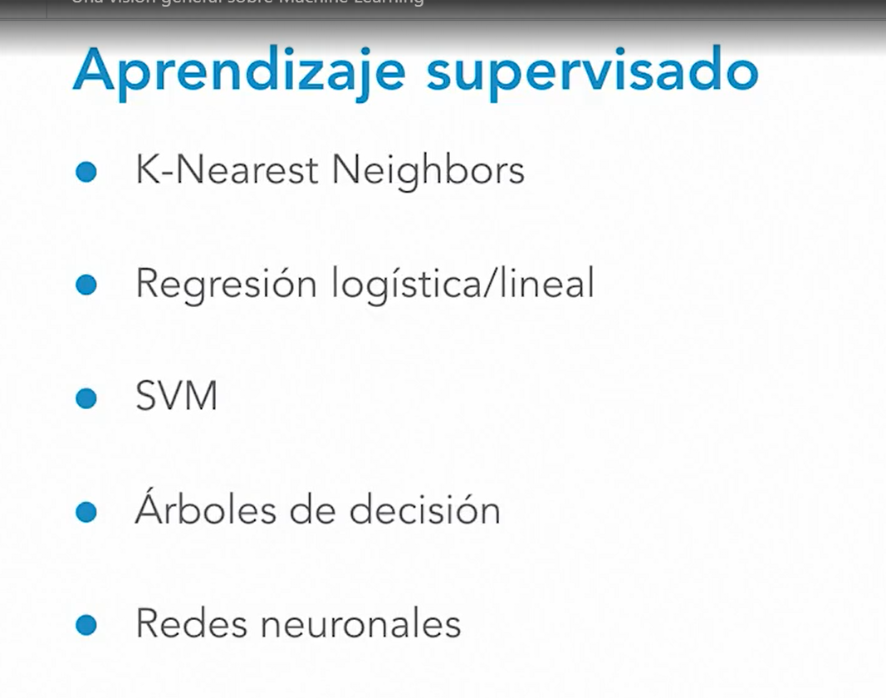  

# non supervised learning
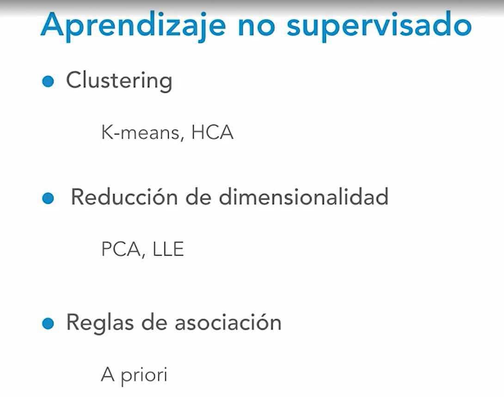  

# Data governance
# bias
- roosevelt 1936
- face recognition for white people
- if the data has some bias, the algorithm wouldn't be able to predict well enough

# data balancing
- is not about few data
- is about low proportion for an specific class, then the hypothesis couldn't be well tested 
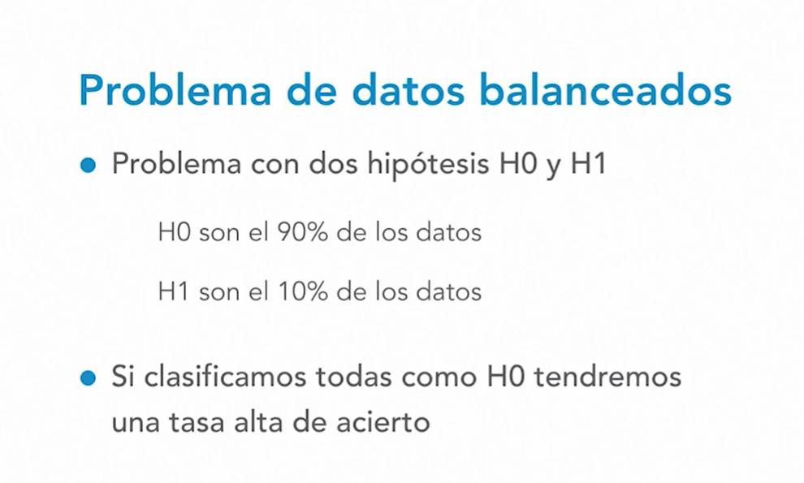  

# data quality volume problem
- high volume not necessary means good predictions
- the data needs to be good
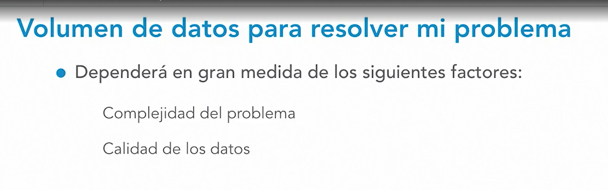d  

# data quality outliers
- errors
- estrange values
- empty values
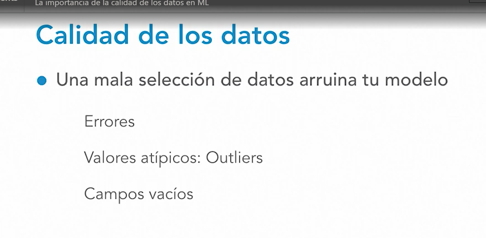  
  
- in these cases we may need to impute or delete that feature

# variable selection
- 8000 sensor variables, we need to keep the relevant variables
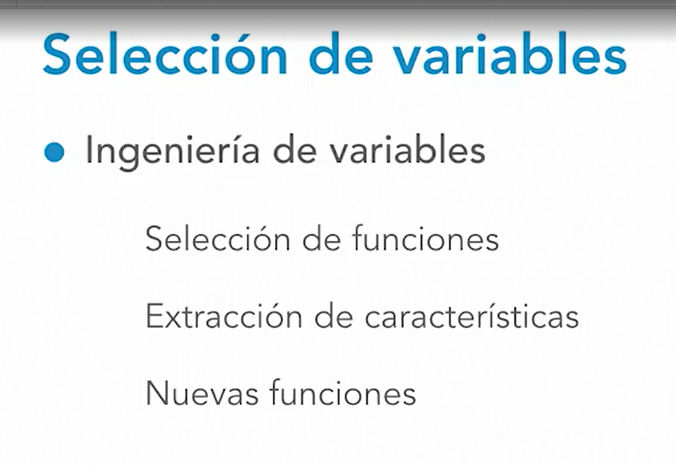  

# Overfitting
- prediction is so tight to the data
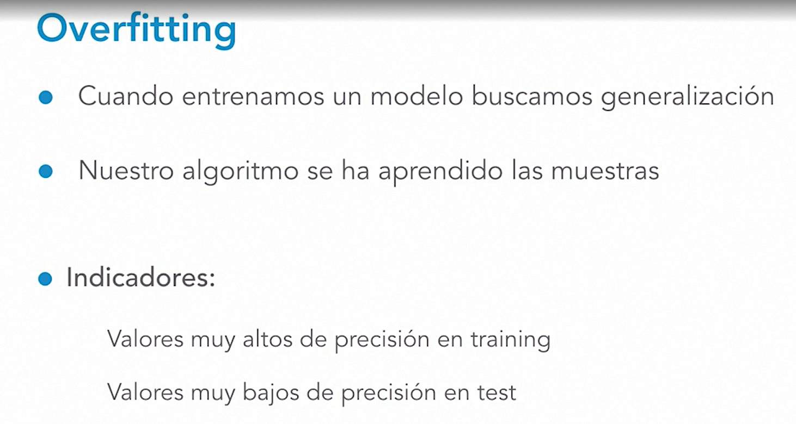  

# Overfitting solutions
- reduce noise
- reduce complexity
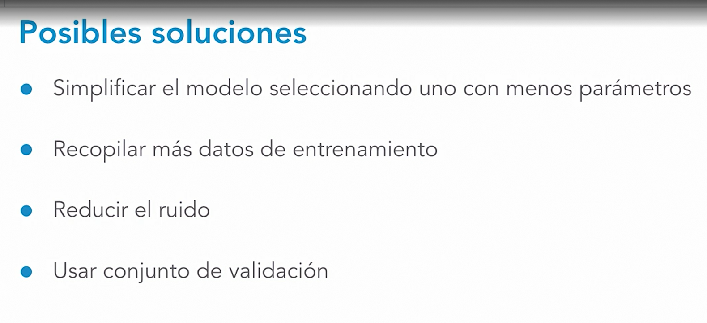  

# underfitting
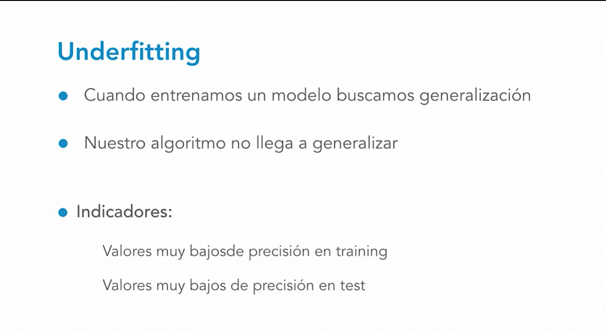  

# underfitting solutions
- leave some date to validate
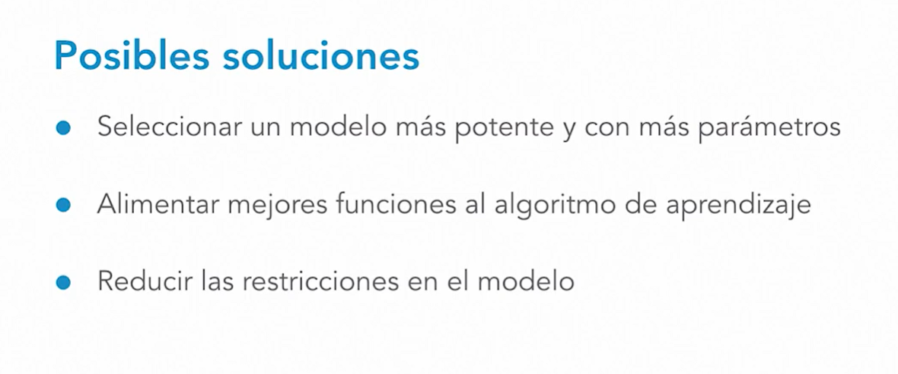  

# data splitting, training, test
- training error
- test error
    - generalization error
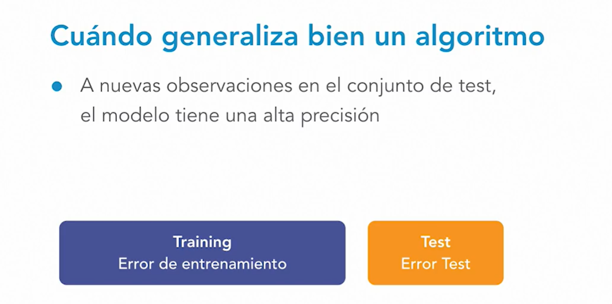  

# validation set
- useful for hyperparameter tuning
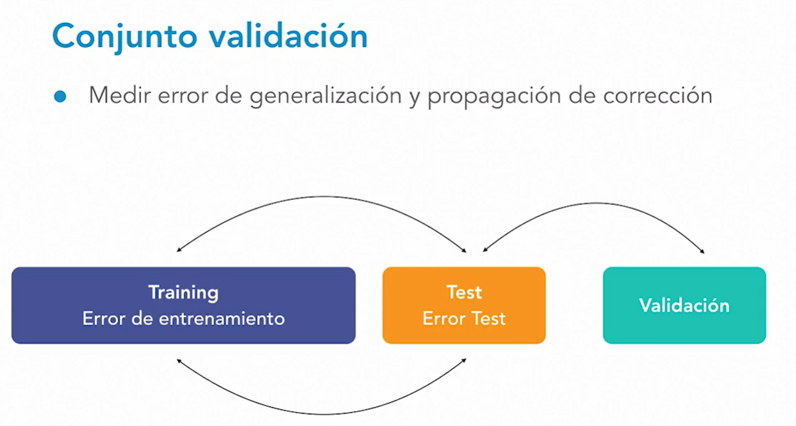  

# cross validation
- k-fold cross validation
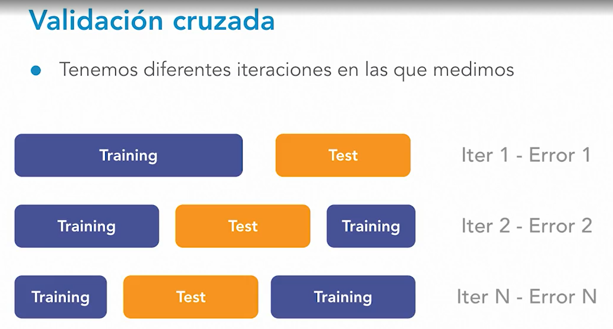  


# Graphs
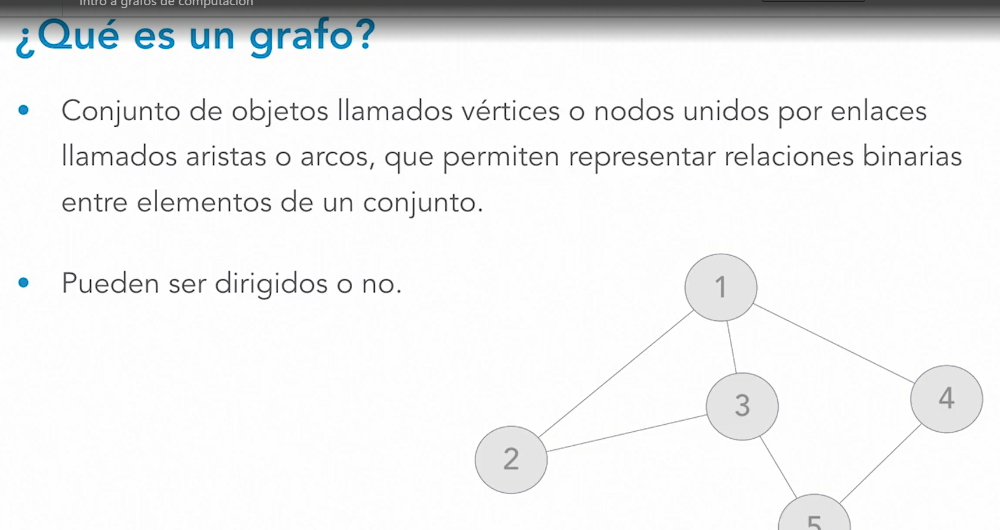  

# Computer graph
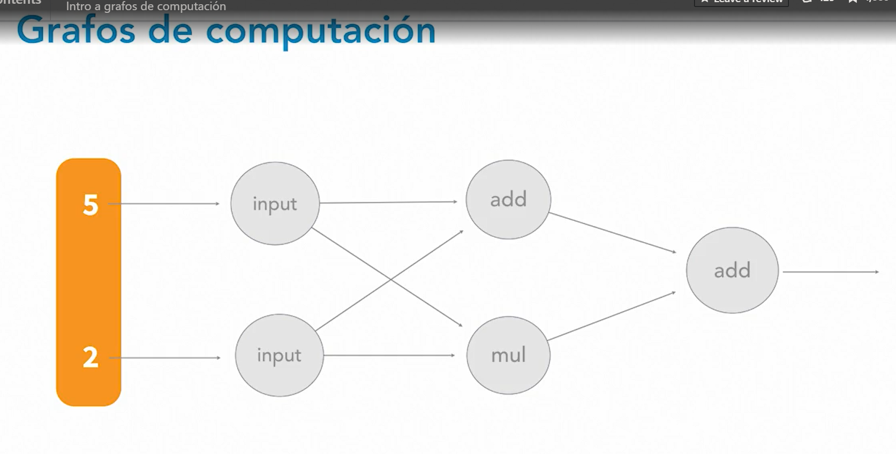  
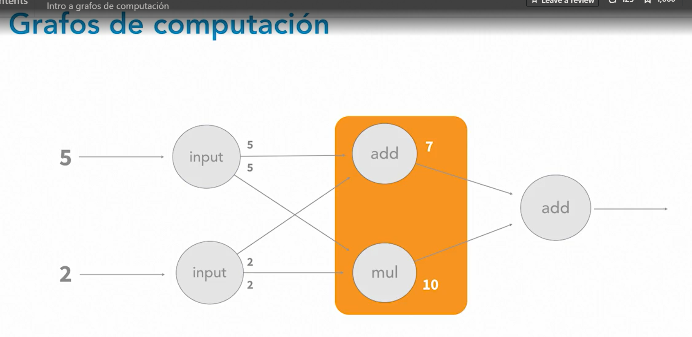  

# tensorflow graph
- directed graph
    - one node is an operation
    - one edge is an input to an operation
        - number
        - matrix
        - tensor
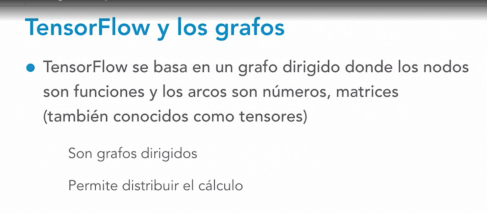  


# tensorflow graph creation
1. define the graph
2. execute the graph with data
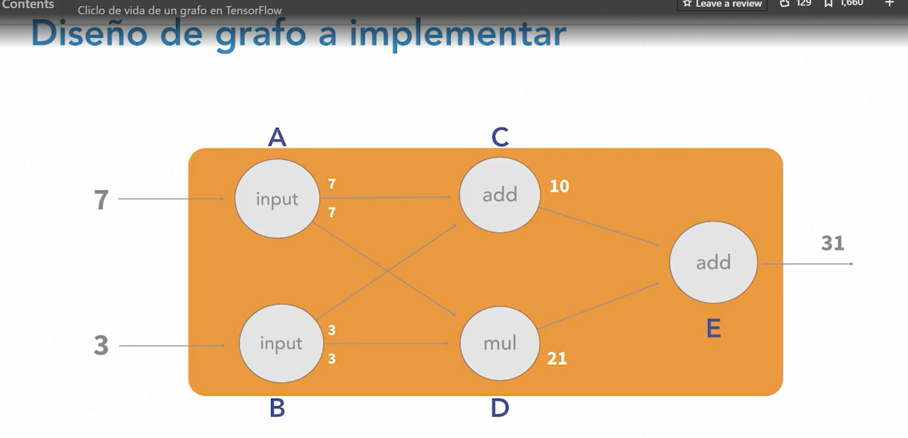  

# code tensorflow basic graph
```python
import tensorflow as tf
myGraph = tf.Graph()
with myGraph.as_default():
    a = tf.constant(7, name="input_a")
    b = tf.constant(3, name="input_b")
    c = tf.add(a, b, name="add_c")
    d = tf.multiply(a, b, name="mul_d")
    e = tf.add(c, d, name="add_e")
    session = tf.compat.v1.Session()
    result = session.run(e)
    print(result)

```

```python
import tensorflow as tf
myGraph = tf.Graph()
with myGraph.as_default():
    a = tf.constant(7, name="input_a")
    b = tf.constant(3, name="input_b")
    c = tf.add(a, b, name="add_c")
    d = tf.multiply(a, b, name="mul_d")
    e = tf.add(c, d, name="add_e")

import tensorflow as tf
myGraph2 = tf.Graph()
with myGraph2.as_default():
    a = tf.constant(7, name="input_a")
    b = tf.constant(3, name="input_b")
    c = tf.add(a, b, name="add_c")
    d = tf.multiply(a, b, name="mul_d")
    e2 = tf.add(c, d, name="add_e")


session = tf.compat.v1.Session(graph = myGraph)
session2 = tf.compat.v1.Session(graph = myGraph2)
result = session.run(e)
result2 = session2.run(e2)
print(result)
print(result2)
```

# tensorflow code : array of operations
```python
import tensorflow as tf
graph = tf.Graph()
with graph.as_default():
    a = tf.constant(7, name="input_a")
    b = tf.constant(3, name="input_b")
    c = tf.add(a, b, name="add_c")
    d = [a,b,c]


session = tf.compat.v1.Session(graph = graph)
result = session.run(d)
print(result)
```

# tensorflow code : dict feed : dict replace
- replace node values by dict entries
```python
heroes = {"name":"batman", "mate":"robbin"}
heroes

import tensorflow as tf
graph = tf.Graph()
with graph.as_default():
    a = tf.add(5, 1)
    b = tf.subtract(5, 1)
    c = tf.multiply(a, b)


session = tf.compat.v1.Session(graph = graph)
result = session.run(c, feed_dict={a:99})
print(result)
```

# tensorflow code : save graph
```python
import tensorflow.compat.v1 as tf
tf.disable_v2_behavior()
graph = tf.Graph()
with graph.as_default():
    a = tf.constant(7, name="input_a")
    b = tf.constant(3, name="input_b")
    c = tf.add(a, b, name="add_c")
    d = tf.multiply(a, b, name="add_d")
    e = tf.add(c,d, name="add_e")

session = tf.compat.v1.Session(graph = graph)
result = session.run(d)
print(result)
writer = tf.summary.FileWriter('./my_graph', graph)
```

# tensorboard
tool to visualize the graph
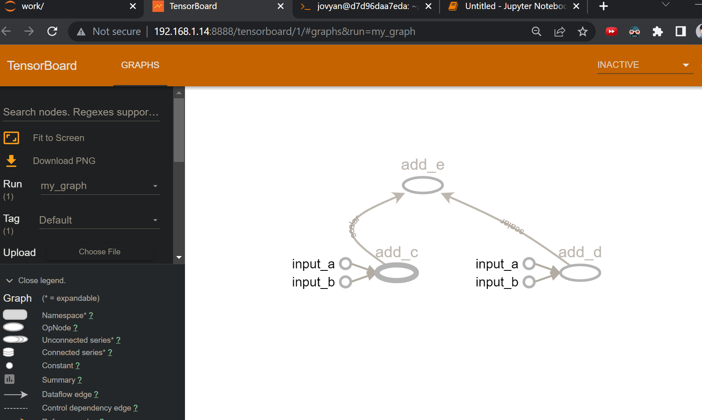  
```shell
docker run -it --rm -p 8888:8888 lspvic/tensorboard-notebook
```

